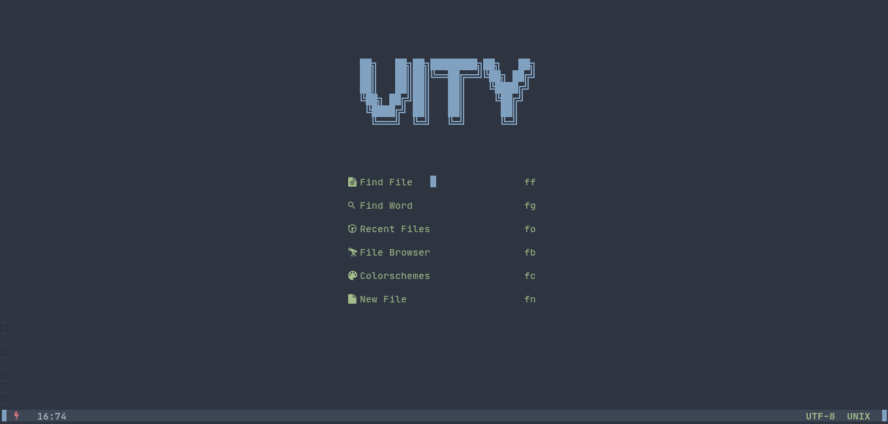
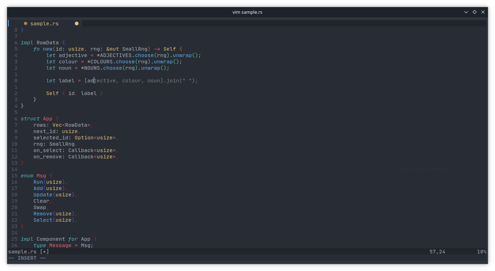

<h1 align="center">Vity ⚡</h1>
<p align="center">IDE-ish bloated neovim distro (WIP ⚒️)<./p>

<div align="center">
  


[](https://www.gnu.org/licenses/gpl-3.0)

</div>

## Showcase



## Features
- IDE-like intellisense and completion with [nvim-cmp](https://github.com/hrsh7th/nvim-cmp) and [github copilot](https://github.com/github/copilot.vim)
- Efficient plugin management with [packer.nvim](https://github.com/wbthomason/packer.nvim)
- Quickly find files and do operations with [nvim-telescope](https://github.com/nvim-telescope/telescope.nvim)
- Quickly explore files with [nvim-tree](https://github.com/kyazdani42/nvim-tree.lua)
- ... and a lot more!

## Installation
To install, just clone the repo in the `~/.config/nvim` directory, you may want to back your current configuration.
> P.S: Vity is currently in WIP, so it is is a bit buggy. Your contributions are highly appreciated!

#### On Linux
```bash
$ git clone https://github.com/vedantnn71/vity.nvim ~/.config/nvim
$ git clone --depth 1 https://github.com/wbthomason/packer.nvim\
 ~/.local/share/nvim/site/pack/packer/start/packer.nvim # install packer first
$ nvim -c "autocmd User PackerComplete quitall" -c "PackerSync" 
```

### TODOs
- [ ] Make installation scripts for mac/linux/windows
- [ ] Fix neovim tree and bufferline collapsing issue
- [ ] Create documentation
<br> ...

#### Inspiration & related projects
- [Nvchad](https://github.com/NvChad/NvChad)
- [Lunar Vim](https://github.com/LunarVim/LunarVim)
- [Doom Emacs](https://github.com/hlissner/doom-emacs)
